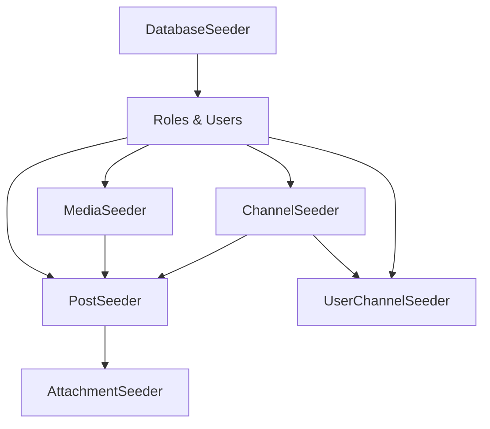

# 🌱 Guía de Seeders - Sistema de Gestión de Contenidos

## 📋 Índice
1. [Introducción](#introducción)
2. [Arquitectura de Seeders](#arquitectura-de-seeders)
3. [Seeders Implementados](#seeders-implementados)
4. [Uso de los Seeders](#uso-de-los-seeders)
5. [Datos Generados](#datos-generados)
6. [Prevención de Duplicados](#prevención-de-duplicados)
7. [Mejores Prácticas](#mejores-prácticas)

---

## 🎯 Introducción

Este sistema cuenta con un conjunto completo de **seeders profesionales** diseñados para poblar la base de datos con **datos de prueba realistas**. Los seeders están diseñados con:

- ✅ **Verificación de duplicados** usando `firstOrCreate()`
- ✅ **Datos realistas y contextualizados**
- ✅ **Relaciones correctamente establecidas**
- ✅ **Orden de ejecución respetando integridad referencial**
- ✅ **Mensajes informativos y estadísticas**

---

## 🏗️ Arquitectura de Seeders

### Orden de Ejecución

Los seeders se ejecutan en el siguiente orden para mantener la integridad referencial:

```
1. DatabaseSeeder (orquestador principal)
   ├── Roles (admin, user)
   ├── Users (admin + usuarios regulares)
   ├── ChannelSeeder ────────────┐
   ├── MediaSeeder ──────────────┤
   ├── PostSeeder ───────────────┤── Independientes
   ├── AttachmentSeeder ─────────┤   (pueden ejecutarse en paralelo)
   └── UserChannelSeeder ────────┘
```

### Dependencias entre Seeders



---

## 📦 Seeders Implementados

### 1️⃣ **DatabaseSeeder** (Principal)

**Archivo:** `database/seeders/DatabaseSeeder.php`

**Responsabilidad:** Orquestar la ejecución de todos los seeders en el orden correcto.

**Características:**
- Crea roles (admin, user)
- Crea usuario administrador desde variables de entorno
- Genera 10 usuarios regulares con el factory
- Llama a todos los seeders específicos
- Muestra tabla resumen con estadísticas

**Variables de Entorno Requeridas:**
```env
ADMIN_EMAIL=admin@example.com
ADMIN_NAME=Admin User
ADMIN_FIRST_NAME=Admin
ADMIN_LAST_NAME=User
ADMIN_MOBILE=+1234567890
ADMIN_PASSWORD=password
```

---

### 2️⃣ **ChannelSeeder**

**Archivo:** `database/seeders/ChannelSeeder.php`

**Responsabilidad:** Crear canales organizacionales del sistema.

**Datos Generados:**
- **4 Departamentos:**
  - Comunicación
  - Recursos Humanos
  - Sistemas
  - Marketing

- **3 Institutos:**
  - Investigación Científica
  - Capacitación Profesional
  - Tecnológico

- **3 Secretarías:**
  - Académica
  - Extensión
  - Cultura

- **3 Centros:**
  - Innovación Digital
  - Atención al Cliente
  - Documentación

**Total:** 13 canales con descripciones y contexto semántico realista.

---

### 3️⃣ **MediaSeeder**

**Archivo:** `database/seeders/MediaSeeder.php`

**Responsabilidad:** Crear medios de distribución de contenido.

**Datos Generados:**

#### 📺 Pantallas Físicas (4)
- Pantalla Principal Hall de Entrada (1920x1080)
- Pantalla Cafetería (1920x1080)
- Pantalla Auditorio (4K - 3840x2160)
- Pantalla Biblioteca (1920x1080 vertical)

#### 📱 Redes Sociales (5)
- Facebook Institucional
- Instagram Oficial
- Twitter/X Corporativo
- LinkedIn Corporativo
- YouTube Institucional

#### 📰 Plataformas Editoriales (3)
- Portal Web Institucional (WordPress)
- Blog Institucional (Medium)
- Newsletter Email (Mailchimp)

**Total:** 12 medios con configuraciones específicas en JSON.

---

### 4️⃣ **PostSeeder**

**Archivo:** `database/seeders/PostSeeder.php`

**Responsabilidad:** Crear posts de ejemplo con diferentes tipos y estados.

**Datos Generados:**

| Tipo | Cantidad | Estados |
|------|----------|---------|
| TEXT | 3 | draft, scheduled, approved |
| IMAGE | 2 | approved (publicado y programado) |
| VIDEO | 2 | approved, scheduled |
| AUDIO | 1 | approved |
| MULTIMEDIA | 2 | approved, scheduled |
| ARCHIVED | 1 | archived |

**Total:** 11 posts con contenido realista.

**Características:**
- Contenido contextualizado (conferencias, eventos, podcasts, etc.)
- Fechas programadas realistas
- Comentarios de moderador
- Relaciones N:M con canales (1-3 canales por post)
- Relaciones N:M con medios (1-4 medios por post)

---

### 5️⃣ **AttachmentSeeder**

**Archivo:** `database/seeders/AttachmentSeeder.php`

**Responsabilidad:** Crear attachments (archivos adjuntos) para los posts según su tipo.

**Lógica de Attachments:**

```php
PostType::IMAGE      → 2 attachments (imagen + thumbnail)
PostType::VIDEO      → 3 attachments (video + thumbnail + subtítulos)
PostType::AUDIO      → 2 attachments (audio + cover)
PostType::MULTIMEDIA → 4 attachments (banner + video + PDF + infografía)
PostType::TEXT       → Sin attachments
```

**MIME Types Soportados:**
- Imágenes: `image/jpeg`, `image/png`
- Videos: `video/mp4`
- Audio: `audio/mpeg`
- Documentos: `application/pdf`
- Subtítulos: `text/vtt`

---

### 6️⃣ **UserChannelSeeder**

**Archivo:** `database/seeders/UserChannelSeeder.php`

**Responsabilidad:** Establecer relaciones N:M entre usuarios y canales.

**Lógica:**
- El usuario **admin** se asigna a **todos** los canales
- Usuarios regulares se asignan a **2-4 canales aleatorios**
- Usa `insertOrIgnore()` para prevenir duplicados en la tabla pivote

---

## 🚀 Uso de los Seeders

### Ejecutar Todos los Seeders

```bash
php artisan db:seed
```

Este comando ejecuta el `DatabaseSeeder` que orquesta todos los demás.

### Ejecutar Seeder Específico

```bash
# Canales
php artisan db:seed --class=ChannelSeeder

# Medios
php artisan db:seed --class=MediaSeeder

# Posts
php artisan db:seed --class=PostSeeder

# Attachments
php artisan db:seed --class=AttachmentSeeder

# Relaciones Usuario-Canal
php artisan db:seed --class=UserChannelSeeder
```

### Refrescar Base de Datos y Ejecutar Seeders

```bash
# ⚠️ CUIDADO: Esto borra TODOS los datos
php artisan migrate:fresh --seed
```

### Ejecutar Solo Migraciones y Luego Seeders

```bash
php artisan migrate
php artisan db:seed
```

---

## 📊 Datos Generados

Después de ejecutar todos los seeders, tendrás:

| Entidad | Cantidad | Descripción |
|---------|----------|-------------|
| **Users** | 11+ | 1 admin + 10 usuarios regulares |
| **Roles** | 2 | admin, user |
| **Channels** | 13 | 4 departamentos, 3 institutos, 3 secretarías, 3 centros |
| **Medias** | 12 | 4 pantallas físicas, 5 redes sociales, 3 plataformas editoriales |
| **Posts** | 11 | Variedad de tipos y estados |
| **Attachments** | ~30 | Según tipo de post |
| **User-Channels** | ~50+ | Admin en todos + usuarios en 2-4 c/u |
| **Post-Channels** | ~30 | 1-3 canales por post |
| **Post-Medias** | ~40 | 1-4 medios por post |

---

## 🛡️ Prevención de Duplicados

Todos los seeders implementan estrategias para prevenir duplicados:

### Método `firstOrCreate()`

```php
Channel::firstOrCreate(
    ['name' => $channelData['name']],  // Condición de búsqueda
    $channelData                        // Datos a crear si no existe
);
```

**Ventajas:**
- ✅ No genera errores de clave duplicada
- ✅ Idempotente (se puede ejecutar múltiples veces)
- ✅ Actualiza datos si cambian (con `updateOrCreate()`)

### Método `insertOrIgnore()`

Para tablas pivote:

```php
DB::table('user_channels')->insertOrIgnore([
    'user_id' => $user->id,
    'channel_id' => $channel->id,
]);
```

---

## 📚 Mejores Prácticas

### 1. **Ejecutar en Entorno de Desarrollo**

```bash
# Verificar entorno
php artisan env

# Solo ejecutar en desarrollo/local
if (App::environment(['local', 'development'])) {
    // seeders
}
```

### 2. **Usar Factories para Usuarios**

```php
User::factory(10)->create()->each(function ($user) {
    $user->assignRole('user');
});
```

### 3. **Datos Realistas y Contextualizados**

- Nombres descriptivos
- Contenido coherente
- Fechas lógicas (pasado/futuro según estado)
- Contexto semántico para IA

### 4. **Verificar Dependencias**

```php
if ($users->isEmpty() || $channels->isEmpty()) {
    $this->command->warn('Prerequisites not met!');
    return;
}
```

### 5. **Mensajes Informativos**

```php
$this->command->info('✅ Channels seeded successfully!');
$this->command->table(['Model', 'Count'], $data);
```

### 6. **Configuración desde .env**

```php
$admin = User::firstOrCreate(
    ['email' => env('ADMIN_EMAIL', 'admin@example.com')],
    // ...
);
```

---

## 🔧 Personalización

### Agregar Más Canales

Edita `ChannelSeeder.php`:

```php
[
    'name' => 'Nuevo Departamento',
    'description' => 'Descripción del departamento',
    'type' => ChannelType::DEPARTMENT->value,
    'semantic_context' => 'Contexto para IA',
],
```

### Cambiar Cantidad de Usuarios

Edita `DatabaseSeeder.php`:

```php
User::factory(20)->create()  // Cambiar de 10 a 20
```

### Agregar Nuevos Tipos de Media

Edita `MediaSeeder.php` y añade:

```php
[
    'name' => 'TikTok Institucional',
    'type' => MediaType::SOCIAL_MEDIA->value,
    'configuration' => json_encode([...]),
    'is_active' => true,
],
```

---

## 🎓 Conceptos Pedagógicos

### ¿Qué es un Seeder?

Un **seeder** es una clase que permite poblar la base de datos con datos de prueba de forma automatizada y reproducible.

### ¿Por qué usar Seeders?

- 🚀 **Desarrollo rápido:** No insertar datos manualmente
- 🧪 **Testing:** Datos consistentes para pruebas
- 👥 **Equipo:** Mismo conjunto de datos para todos
- 📦 **Demos:** Datos realistas para presentaciones

### firstOrCreate() vs create()

```php
// create() - Siempre crea, puede fallar si ya existe
User::create(['email' => 'test@test.com']);

// firstOrCreate() - Busca primero, crea solo si no existe
User::firstOrCreate(
    ['email' => 'test@test.com'],
    ['name' => 'Test User']
);
```

---

## 🐛 Troubleshooting

### Error: "SQLSTATE[23000]: Integrity constraint violation"

**Solución:** Los seeders ya están protegidos con `firstOrCreate()`. Si persiste:

```bash
php artisan migrate:fresh --seed
```

### Error: "Class 'ChannelSeeder' not found"

**Solución:**
```bash
composer dump-autoload
php artisan db:seed
```

### Los datos no aparecen

**Verificar:**
```bash
php artisan tinker
>>> User::count()
>>> Channel::count()
>>> Post::count()
```

---

## 📝 Notas Finales

- Los seeders están diseñados para ejecutarse múltiples veces sin errores
- Todos los datos incluyen contexto semántico para facilitar búsquedas con IA
- Las relaciones N:M se establecen automáticamente
- Los attachments se crean según el tipo de post
- El sistema es completamente extensible

---

**Autor:** Sistema de Gestión de Contenidos  
**Última actualización:** Octubre 2025  
**Versión:** 1.0.0
